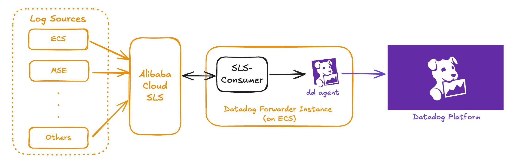

# Alibaba Cloud SLS Logs Integration

## Overall Architecture 

## Required Components 
1. RAM (Resource Access Management) User to have the right permission to pull logs from the required SLS endpoints
2. Datadog Agent to be installed on the same ECS instance (as the SLS-consumer script)
3. [Configure Datadog Agent](https://docs.datadoghq.com/agent/logs/?tab=tcpudp) to be able to ingest logs from TCP  

